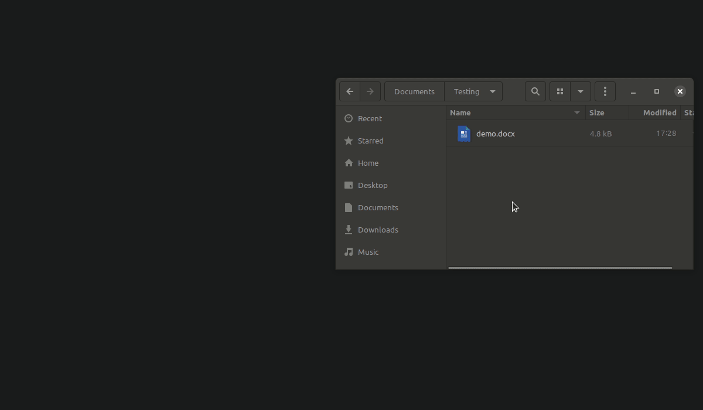
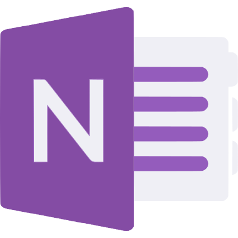
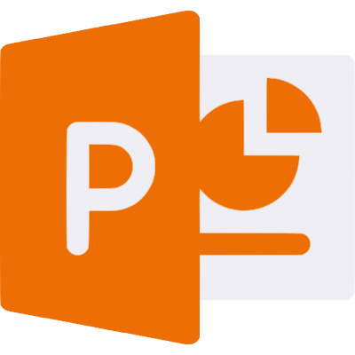
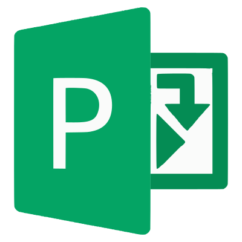

# Loffice 365

An electron wrapped Office 365 application integrated into your file manager as if it was a native application.



## Supported applications

<table cellpadding="10" cellspacing="0" border="0">
  <tr>
    <td></td><td>Microsoft Excel 365</td>
    <td></td><td>Microsoft OneNote 365</td>
  </tr>
  <tr>
    <td></td><td>Microsoft Outlook 365</td>
    <td></td><td>Microsoft PowerPoint 365</td>
  </tr>
  <tr>
    <td></td><td>Microsoft Project 365</td>
    <td></td><td>Microsoft Word 365</td>
  </tr>
</table>

## How it works
- When opening a file on your local system, it is symlinked to a temporary OneDrive folder
- The [onedrive](https://github.com/abraunegg/onedrive) application is then used to synchroize that folder to OneDrive
- The file is then opened in a [nativefied](https://github.com/nativefier/nativefier) version of Office 365
- Once the application is closed, [onedrive](https://github.com/abraunegg/onedrive) syncs the file back locally, and the file in OneDrive is removed

## Installation
First, you will need the linux OneDrive CLI client and zenity if it is not already installed. In Ubuntu, this can be installed with:
``` bash
sudo add-apt-repository ppa:yann1ck/onedrive
sudo apt-get update
sudo apt install onedrive zenity
```
Next, login to your OneDrive personal or business account:
``` bash
onedrive
```
After visiting the URL that is provided, your browser will end on a blank page. Copy the URL from the location bar, and paste it at the prompt to complete the login.

After that, run the installer for Loffice 365:
``` bash
curl -s https://raw.githubusercontent.com/Fmstrat/loffice-365/main/installer.sh | bash -s
```

## Usage
Simply run one of the available commands, start from a shortcut, or double click/right click and open a file.
- `excel`
- `office`
- `onenote`
- `outlook`
- `powerpoint`
- `project`
- `word`

## Compiling yourself
Docker is required to build images.

Create the nativefier image for docker:
``` bash
./build.sh image
```

Run the build:
``` bash
./build.sh
```

After that, setup onedrive as above then run the installer for Loffice 365 using the archive you just built:
``` bash
./installer.sh binaries/loffice-365.tgz
```

## Icon licenses
- Fluent UI React - Icons under [MIT License](https://github.com/Fmstrat/fluent-ui-react/blob/master/LICENSE.md)
- Fluent UI - Icons under [MIT License](https://github.com/Fmstrat/fluentui/blob/master/LICENSE) with [restricted use](https://static2.sharepointonline.com/files/fabric/assets/microsoft_fabric_assets_license_agreement_nov_2019.pdf)
- New app icons made by [Pixel perfect](https://www.flaticon.com/authors/pixel-perfect) from [www.flaticon.com](https://www.flaticon.com/), except for the OneNote and Project icons which were made by Adil based on the other Pixel perfect icons.
